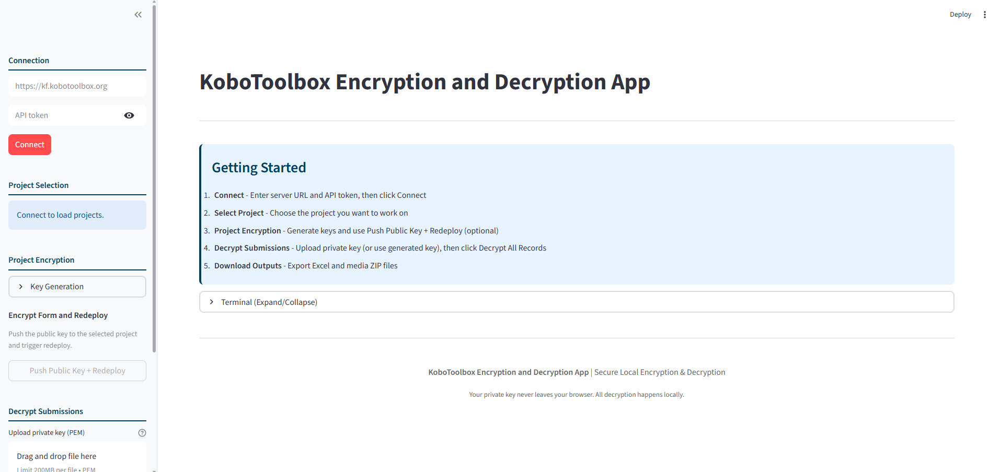

# KoboToolbox Encryption and Decryption App

A Streamlit web application for encrypting and decrypting KoboToolbox form submissions using RSA and AES encryption.



## Features

- **Connect to KoboToolbox** - Authenticate with your KoboToolbox server
- **Project Selection** - Choose an encrypted project to decrypt
- **Project Encryption Automation** - Push public key and redeploy directly from the app
- **API Decryption** - Fetch encrypted submissions and attachments directly from the API
- **Batch Decryption** - Decrypt multiple encrypted submissions at once
- **Encrypted Media Support** - Decrypt encrypted photo/audio/video attachments
- **Table Preview** - View decrypted data in a table
- **Excel Export** - Download decrypted data as an XLSX file
- **Media ZIP Export** - Download decrypted media files in a single ZIP package
- **Last Encryption Result Panel** - Shows form name, encrypted status, version, and private key download
- **Activity Terminal** - View all automation and decryption logs in one collapsible panel at the bottom of the page

## Requirements

- Python 3.10+
- Streamlit
- Cryptography library
- Requests library
- pandas
- openpyxl

## Installation

```bash
# Clone the repository
git clone https://github.com/JamesLeonDufour/kobotoolbox-encryption-decryption-app.git
cd kobotoolbox-encryption-decryption-app

# Install dependencies
pip install -r requirements.txt
```

## Usage

```bash
# Run the app
streamlit run app.py
```

The app will open in your browser at http://localhost:8501

## Getting Your KoboToolbox API Token

1. Log in to your KoboToolbox server
2. Go to **Account Settings** (click your username in the top right)
3. Click on the **Tokens** tab
4. Create a new token and copy it

## Workflow

### Step 1: Generate Encryption Keys

1. Click "Generate Key Pair" in the sidebar
2. The app auto-downloads both private and public PEM files
3. Copy the public key (for KoboToolbox form settings)

### Step 2: Configure Encryption (manual or automated)

Option A (manual in KoboToolbox):
1. In KoboToolbox, go to your form's **Settings** -> **Encryption**
2. Enable encryption
3. Paste the public key you generated
4. Redeploy the form

Option B (from this app):
1. Connect and select the project
2. Go to **Project Encryption**
3. Click **Push Public Key + Redeploy**
4. Review **Last Encryption Result** on the main page

### Step 3: Connect, Select, Decrypt

1. In the sidebar, enter your server URL (e.g., https://kf.kobotoolbox.org)
2. Enter your API token and click **Connect**
3. Select the project
4. Upload your private key
5. Click **Decrypt All Records**
6. Review the decrypted table
7. Download the decrypted XLSX
8. Download the decrypted media ZIP (if encrypted media exists)
9. Open **Activity Terminal** at the bottom of the page to inspect actions/errors in one place

## Security Notes

- **Never share your private key**
- The private key is used locally and never sent to any server
- Only the public key should be configured in KoboToolbox

## Troubleshooting

### "No encrypted records found"
- Ensure the form has encrypted submissions
- Confirm the API token can access the data endpoint

### "Key decryption failed"
- Verify you're using the correct private key for the form
- Check that the form wasn't redeployed with a different key

### "No download_url for attachment"
- Ensure the API token has access to the project data
- Some records may not have attachments; the app skips them safely

### "Permission denied while updating settings/redeploying"
- Your token does not have required project permissions
- Try with an owner/admin token for that project


## Project Structure

```
kobotoolbox-encryption-decryption-app/
|-- app.py                 # Main Streamlit application
|-- requirements.txt       # Python dependencies
|-- README.md              # This file

```

